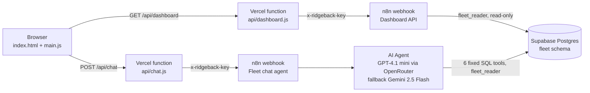

# App: dashboard and chat (Task 3)

A static page (HTML, CSS and plain JavaScript with Chart.js) plus two Vercel serverless functions. The browser only talks to its own origin. The n8n webhook URLs and the shared secret stay in Vercel environment variables.



## What is on the page

| Section | Source | Notes |
| --- | --- | --- |
| KPI tiles | `fleet.dashboard_snapshot()` → `kpis` | Run hours, active machines, safety events (and per run hour), impacts, active drivers |
| Run hours by branch | `daily_hours_by_branch` | Line per branch across the week; columns when one day is selected |
| Safety events by branch | `safety_by_branch` | Event types grouped, one bar per branch. Branch colours match the chart above |
| Drivers with the most safety events | `top_drivers` | Top 8, with events per run hour so busy drivers are compared fairly. "No driver logged on" is excluded and reported in a footnote |
| Run hours by machine | `machine_hours` | All 30 machines. P57083 shows "no data" because it never reported |
| Data quality | `data_quality` | Per file: rows read, loaded and rejected, with plain-English reasons; missing days are flagged |
| Chat | n8n "Fleet chat agent" | Suggested questions, 500-character limit, one session per browser tab |

The Period filter scopes everything on the page: the whole week, or one day (`?from=&to=` is passed to `dashboard_snapshot`). Every chart has a Table toggle, so values are never only in a colour or a tooltip. Light and dark themes follow the OS, with a manual toggle. The colour palette was checked for colour-blind separation.

## Server-side guards (`api/`)

- Secrets come only from environment variables. Nothing secret is in the repo or the browser.
- **Chat:** POST + JSON only; the message must be 1–500 characters; the session id is sanitised; 45 s timeout; at most 10 questions per minute per IP. The limit is best effort, per serverless instance; production would use a shared store or Vercel firewall rules.
- **Dashboard:** GET only; dates must be `YYYY-MM-DD` or they are ignored; 15 s timeout; CDN cache of 5 minutes, because the data changes once a day.
- Upstream errors are logged, and the browser gets a friendly message without internal details.
- `vercel.json` sets a strict Content-Security-Policy (`'self'` only, no inline scripts), `nosniff`, a referrer policy, and limits on function duration.

## Deploy on Vercel

1. In Vercel, choose **Add New → Project** and import the GitHub repo. Set **Root Directory** to `app`. Framework preset: **Other**. There is no build command.
2. Add these environment variables (Production and Preview):

   | Name | Value |
   | --- | --- |
   | `N8N_DASHBOARD_URL` | `https://<your-n8n>/webhook/ridgeback-dashboard` |
   | `N8N_CHAT_URL` | `https://<your-n8n>/webhook/ridgeback-chat` |
   | `N8N_WEBHOOK_SECRET` | the value in the n8n **Ridgeback webhook secret** credential |

3. Deploy. Both n8n workflows must be **published** (active) for the production webhook URLs to answer.

## Run locally

```bash
npm i -g vercel
cd app
vercel dev          # serves the page and /api/* on http://localhost:3000, using .env.local
```

## n8n workflows

The exports are in [`pipeline/n8n/`](../pipeline/n8n), next to the ingestion workflow. The system prompt is also kept as text in [`agent/system-prompt.md`](agent/system-prompt.md).

- [`Ridgeback Logistics - Fleet chat agent.json`](../pipeline/n8n/Ridgeback%20Logistics%20-%20Fleet%20chat%20agent.json): webhook (header auth) → normalise and validate → AI Agent with six read-only Postgres tools and window memory → JSON response, with a friendly error branch.
- [`Ridgeback Logistics - Dashboard API.json`](../pipeline/n8n/Ridgeback%20Logistics%20-%20Dashboard%20API.json): webhook (header auth) → `select fleet.dashboard_snapshot($1, $2)` → JSON, or 503 on error.
