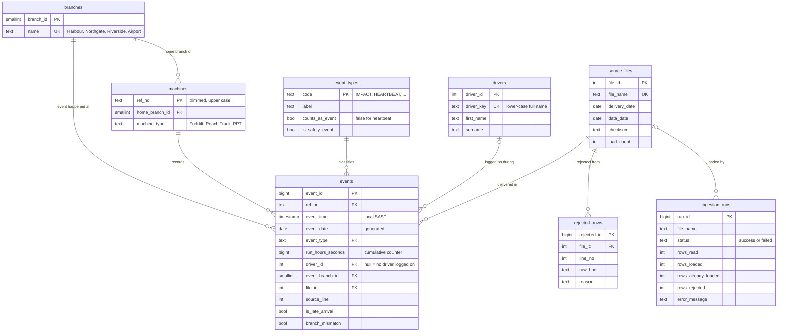

# Data model and cleaning rules

All tables live in the `fleet` schema in Postgres (Supabase). The DDL is in [`pipeline/sql/`](../pipeline/sql), applied in order `001` to `008`.

## Entity relationship diagram

Interactive version (Lucidchart, view only): https://lucid.app/lucidchart/bf3b05b2-59e3-4c40-8044-62909997a374/edit?invitationId=inv_db946d12-bcc2-4be2-90a5-69ea24fcfe80

The Mermaid version below is the source kept with the code: GitHub renders it, and schema changes show up in the diff.

**Why it's shaped this way**

- **One fact table, `events`, with a natural unique key** `(ref_no, event_time, event_type, run_hours_seconds)`. Loading the same file twice, or receiving an event again in a later file, can never create a duplicate.
- **Reference tables** (`branches`, `machines`, `drivers`, `event_types`) keep names consistent and let new branches, machines, drivers or event types be added without schema changes.
- **`event_types` carries the business rules**: whether a row counts as an event, and whether it's a safety event. Dashboard and chat queries filter on these flags instead of hard-coding lists.
- **Bookkeeping tables** (`source_files`, `rejected_rows`, `ingestion_runs`) make every load traceable: what arrived, what was rejected and why, and how each run went.
- **Calculations live in views**, so the dashboard and the chat read the same numbers:

| View | What it gives |
| --- | --- |
| `v_events` | Every event with machine, type, branch and driver names |
| `v_run_intervals` | Each gap between counter readings and the run time it contributes |
| `v_machine_daily_hours` | Run hours per machine per day |
| `v_driver_daily_hours` | Run hours per driver per day |
| `v_event_counts` | Event counts by day, branch, machine, driver and type (heartbeats excluded) |
| `v_available_days` | Dates with data and their day names, so "Tuesday" maps to a real date |
| `v_latest_runs`, `v_rejections_by_reason` | Data quality: last run per file, rejections by reason |

## Cleaning rules

Implemented in [`pipeline/src/clean.js`](../pipeline/src/clean.js) as one dependency-free function, `cleanFile()`, so the n8n Code node and the tests run identical code. Tests: `npm test`.

| # | Rule | What it handles in this data |
| --- | --- | --- |
| 1 | Map columns by header name, not position | 09-13 file renames and reorders columns (`Branch Name, Ref No, ...`) |
| 2 | Fail the whole file if a required column is missing | Protects against a wrong or corrupt file |
| 3 | Reject repeated header rows | 09-12 file has the header again mid-file |
| 4 | Reject rows with the wrong number of columns | 09-12 file ends with a cut-off row |
| 5 | Accept ISO 8601 and `dd/mm/yyyy hh:mm:ss`; reject anything else | 09-11 file uses day/month/year |
| 6 | Reject events dated on or after the file's delivery date | A file can only hold earlier events |
| 7 | Trim and upper-case reference numbers, in both the telemetry and the machine list | Stray spaces such as `' FBA17235852174'` and `'P24799 '` |
| 8 | Reject machines not in the machine list | `FBA37633406217` in the 09-14 file |
| 9 | Reject unknown event types | Guard for future changes |
| 10 | Reject non-numeric or negative RunHours | Guard |
| 11 | Reject exact duplicates within a file | About 70 duplicate rows across the week |
| 12 | Normalise branch names: trim, collapse spaces, drop "Ridgeback", title case | `RIDGEBACK HARBOUR`, `Ridgeback  Airport ` |
| 13 | Normalise driver names to title case and match on a lower-case key | `ASHWIN DANIELS` and `Ashwin Daniels` are one driver |
| 14 | Keep late-arriving events, flagged `is_late_arrival` | 09-09 file includes 11 events from 7 Sep; the unique key drops the ones already loaded |
| 15 | Keep events at a branch other than the machine's home branch, flagged `branch_mismatch` | `R88897` (Northgate) reports from Riverside on 10–11 Sep |

## Run hours

`RunHours` is a cumulative counter in seconds, like an odometer. Run time on a day is how much it went up that day, calculated in `v_run_intervals`:

1. Order each machine's readings for the day by time.
2. For each pair of consecutive readings, take the increase.
3. Cap the increase at the clock time between the readings: a motor can't run 20 minutes in 15.
4. If the counter goes down, treat it as a reset: that gap adds nothing, and the new value becomes the baseline.

"Last reading minus first reading" fails on this data. `FBA33639374813` resets twice on 8 Sep; the simple method reports 5,508 hours for that day, while this method gives 9.92 hours. The same rule is implemented in `pipeline/src/runHours.js`, and the database figures were checked against it.
