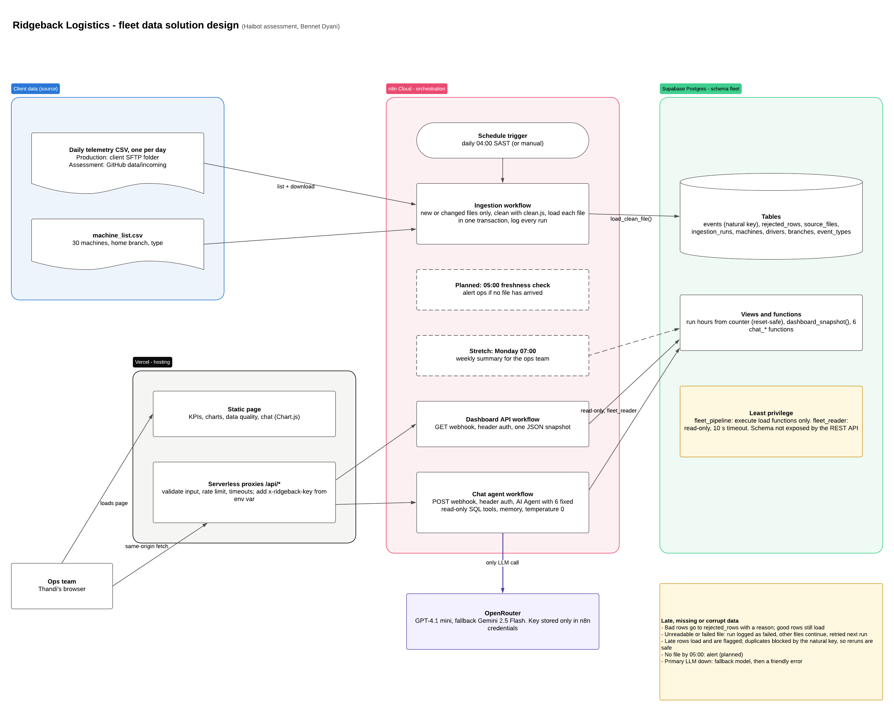

# Solution design (Task 4)

- **Interactive version (Lucidchart, view only):** https://lucid.app/lucidchart/612a57a0-f199-40b8-aa0a-26bdcaa198d0/edit?invitationId=inv_f529f2f7-befa-4392-bad9-a3d00bf07c2e
- **Source:** [`solution_design.lucid.json`](solution_design.lucid.json), in Lucid Standard Import format. It can be re-imported into Lucidchart to rebuild or edit the diagram.

## How to read it

| Question | Answer in the design |
| --- | --- |
| **What runs, and what starts it?** | The **ingestion workflow** runs on an n8n schedule at 04:00 SAST, and can also run manually. The **dashboard** and **chat** workflows run when a webhook is called from the Vercel functions. The dashed boxes are planned work: a 05:00 freshness alert and the Monday 07:00 summary. |
| **Where is data stored?** | Supabase Postgres, in its own `fleet` schema. Supabase's REST API doesn't expose that schema. The tables hold clean events, rejected rows (with reasons), the file register and the run log. |
| **How does the chat find answers?** | Browser → `/api/chat` (Vercel, adds the secret) → n8n webhook → AI Agent. The agent can only call **6 fixed, parameterised SQL functions** as the read-only `fleet_reader` user. It never writes SQL itself, and every number in an answer comes from a tool result. |
| **Where is the LLM called, and where is the key?** | Only in the chat agent workflow, through OpenRouter (GPT-4.1 mini, with Gemini 2.5 Flash as a fallback). The API key is stored only in n8n's encrypted credentials. It is never sent to the browser, Vercel or the repo. |
| **Late data** | Rows older than the file's date still load and are flagged `is_late_arrival`. The natural key stops them duplicating events that already arrived. |
| **Missing data** | Each run loads every new or changed file, so a file that arrives late is picked up on the next run. Missing days show up in the dashboard's data-quality panel and through the chat's `get_data_quality` tool. Planned: a 05:00 check that alerts ops when no file has arrived. |
| **Corrupt data** | Bad rows go to `rejected_rows` with a reason, and the good rows in the same file still load. A file that can't be read or loaded is logged as `failed`. The other files continue, and the failed one is retried on the next run because it is never registered as loaded. |

## Production changes from the assessment setup

- **File source:** the assessment reads `data/incoming/` on GitHub. In production, the "List incoming files" and "Download file" nodes would point to the client's SFTP folder, using n8n's SFTP node. Everything after the download stays the same.
- **Database TLS:** n8n currently connects with "Ignore SSL issues", because Supabase uses its own certificate authority. In production, I'd install the Supabase CA certificate in the credential instead.
- **Rate limiting:** the Vercel functions limit requests per instance. In production, I'd use a shared store or Vercel firewall rules.
