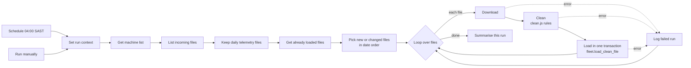

# Pipeline (Task 2)

An n8n workflow loads each daily telemetry file into Postgres (Supabase) at **04:00 SAST**. The workflow export is in [`n8n/`](n8n).



## What it guarantees

| Requirement | How |
| --- | --- |
| Runs every morning at 04:00 | Schedule trigger, workflow time zone `Africa/Johannesburg` |
| Clean with the Task 1 rules | The *Clean file* Code node is generated from [`src/clean.js`](src/clean.js) by [`scripts/build-n8n-workflow.js`](scripts/build-n8n-workflow.js), the same code the unit tests run |
| Record unusable rows with the reason | `fleet.rejected_rows` (one row per rejected line: line number, raw text, reason) |
| Identical result if a file is loaded again | Events have a natural unique key `(ref_no, event_time, event_type, run_hours_seconds)`; rejected rows are unique per `(file, line)`. Files already loaded with the same content (GitHub blob SHA) are skipped |
| Log each run | `fleet.ingestion_runs`: file, rows read, loaded, already loaded, rejected, status, error |
| One bad file never stops the rest | Download, clean and load each send errors to *Log failed run*, then the loop continues. A failed file is not registered in `source_files`, so it is retried on the next run |
| Files load in date order | *Pick files to load* sorts by file name (`YYYY-MM-DD_...`) |

Each file is loaded by one call to `fleet.load_clean_file(jsonb)`, which runs in a single transaction: the file is loaded completely or not at all. The same call syncs the machine list, so new machines are added before the events that reference them.

## How to run it

**Prerequisites**

1. Apply the SQL in [`sql/`](sql) to a Postgres database, in order `001` to `006`.
2. Set passwords for the two roles (never commit them):
   ```sql
   alter role fleet_pipeline with password '...';
   alter role fleet_reader   with password '...';
   ```
3. In n8n, create a **Postgres** credential for `fleet_pipeline`. On Supabase use the **Session pooler** host and port 5432, user `fleet_pipeline.<project-ref>`, SSL *Require*. Supabase uses its own certificate authority, so either add the Supabase CA certificate or enable *Ignore SSL Issues* (traffic stays encrypted).
4. Import [`n8n/ridgeback-daily-ingestion.json`](n8n) into n8n and select that credential on the four Postgres nodes.

**Run**

- **Scheduled:** activate the workflow. It runs at 04:00 SAST and loads any new or changed file.
- **Manually:** open the workflow and click *Execute workflow*. To reload every file (for example, to demonstrate that reloading is safe), set `reprocess_all` to `true` in *Set run context*.

**Check the result**

```sql
select file_name, status, rows_read, rows_loaded, rows_already_loaded, rows_rejected, error_message
from fleet.ingestion_runs order by run_id desc;

select reason, count(*) from fleet.rejected_rows group by reason;
```

## Source of files

In production the provider drops files into an SFTP folder. For this assessment the workflow reads them from this repository's `data/incoming/` folder through the GitHub API (`repo` and `branch` are set in *Set run context*). Swapping in an SFTP node changes only the *List incoming files* and *Download file* steps; cleaning and loading stay the same.

## Results on the seven files

| File (delivery date) | Data day | Rows read | Loaded | Already loaded | Rejected | Rejection reasons |
| --- | --- | --- | --- | --- | --- | --- |
| 2026-09-08 | Mon 7 Sep | 950 | 936 | 0 | 14 | duplicates |
| 2026-09-09 | Tue 8 Sep | 979 | 957 | 8 | 14 | duplicates (8 late events from Monday were already loaded) |
| 2026-09-10 | Wed 9 Sep | 987 | 973 | 0 | 14 | duplicates |
| 2026-09-11 | Thu 10 Sep | 939 | 926 | 0 | 13 | duplicates (day/month/year dates parsed) |
| 2026-09-12 | Fri 11 Sep | 816 | 802 | 0 | 14 | duplicates, repeated header, truncated last row |
| 2026-09-13 | Sat 12 Sep | 397 | 392 | 0 | 5 | duplicates (renamed, reordered columns handled) |
| 2026-09-14 | Sun 13 Sep | 108 | 86 | 0 | 22 | 21 rows from a machine not in the machine list, 1 duplicate |

Total: **5,072 events**, 96 rejected rows. Reloading all seven files afterwards inserted 0 rows. A test with a missing file logged it as `failed` (HTTP 404) and the remaining files still loaded.

**Unattended runs:** the schedule has fired by itself at 04:00 SAST every day since it was activated, and each run succeeded. On 4 and 5 October it found the seven files already loaded (same name and content hash), so it loaded nothing, which is correct because no new file had arrived. Every run, including one with nothing new, writes a row to `fleet.pipeline_runs` (migration `009`); `fleet.ingestion_runs` keeps one row per file processed.

## Rebuilding the n8n Code node

`clean.js` is the single source of truth. After changing it, run the tests, then regenerate the workflow code:

```bash
npm test
node pipeline/scripts/build-n8n-workflow.js > /tmp/workflow.sdk.ts
```
